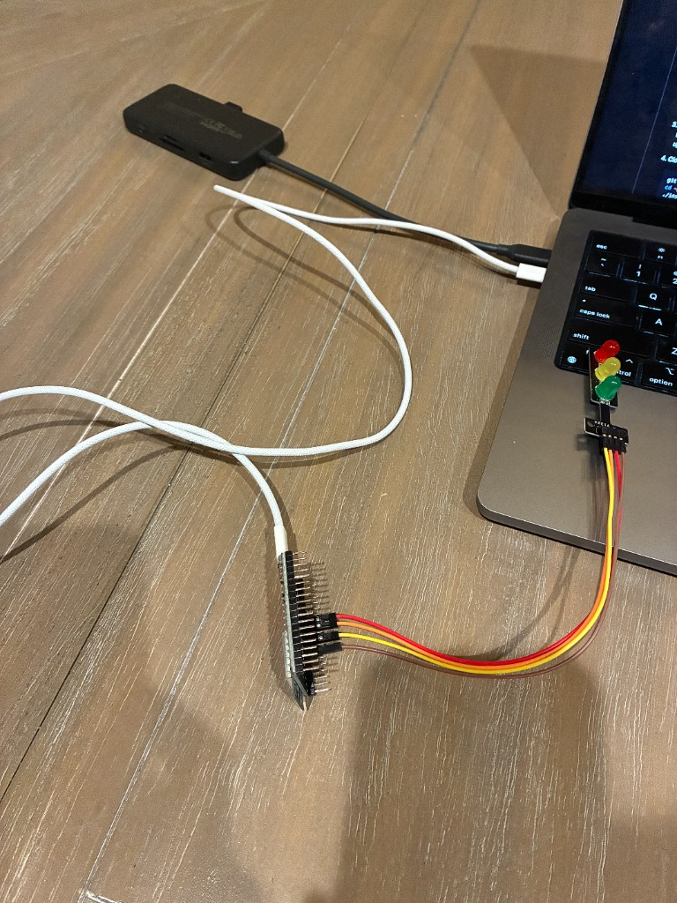
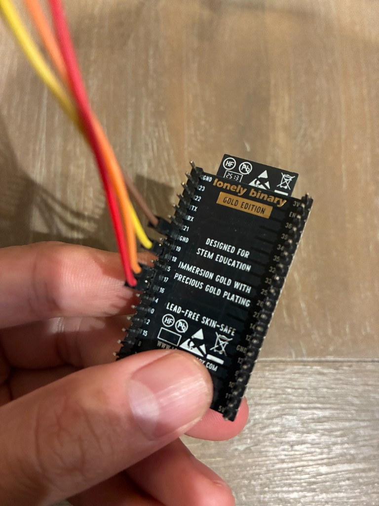

# status-light (Claude Code, Cursor, Codex)

<a href="https://www.youtube.com/shorts/_3KwVCMfQk8">
  
</a>

*Click to watch the 30-second demo on YouTube*

A small desk traffic light that mirrors what your AI coding agent is doing.

- **Yellow (breathing)** — the agent is working
- **Green** — task completed
- **Red** — a tool call failed

Works with Claude Code, Cursor, and Codex.

---

## What you need

- ESP32 dev board — [Amazon](https://www.amazon.com/dp/B0FR3GVRD5?ref=ppx_yo2ov_dt_b_fed_asin_title)
- Mini traffic-light LED module (jumper wires included) — [Amazon](https://www.amazon.com/dp/B09TL6TP9T?ref=ppx_yo2ov_dt_b_fed_asin_title)
- A USB **data** cable for the ESP32-to-Mac connection (charge-only cables won't show a serial port)
- A Mac (Linux/Windows should also work, but macOS is what's tested)

Here's the full hardware setup once everything is connected:



---

## Setup

1. **Install Arduino IDE.** Download from [arduino.cc/en/software](https://www.arduino.cc/en/software). In Boards Manager, install **`esp32` by Espressif Systems** (version 3.0 or newer).
2. **Wire it up.** Connect the LED module to the ESP32:

   | Module | ESP32 |
   |---|---|
   | `GND` | `GND` |
   | `R`   | `GPIO16` |
   | `Y`   | `GPIO17` |
   | `G`   | `GPIO18` |

   

3. **Upload the firmware.** In Arduino IDE, open [`firmware/esp32-traffic-light/esp32-traffic-light.ino`](firmware/esp32-traffic-light/esp32-traffic-light.ino), select **Board: ESP32 Dev Module** and the matching **Port** (something like `/dev/cu.wchusbserial...`), then click upload.
4. **Clone this repo and run the installer.**

   ```bash
   git clone https://github.com/Z060049/traffic-light-ESP32-Claude-Cursor-Codex.git ~/Projects/status-light
   cd ~/Projects/status-light
   ./install.sh
   ```

   The installer adds hooks to Cursor and Claude Code, sets up a `light` shell alias, and remembers your ESP32's serial port.

5. **Test it.** Open a new terminal and run:

   ```bash
   light thinking   # yellow breathing
   light done       # green
   light error      # red
   light off        # all off
   ```

Then start a Cursor or Claude Code session — the light will follow it.
